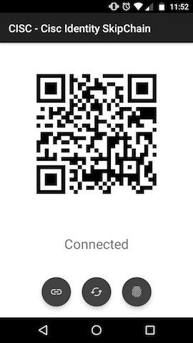

# CISC Cothority Identity Skipchain SSH Interface

### Functionality

EPFL Semester Project Fall 2016. Proof of concept Android application for managing
SSH keys via a [Cothority](https://github.com/dedis/cothority) service.

### Features

- Join Android device to existing Skipchain (via QR-code)
- Add and update SSH keys
- Vote on proposals from other devices
- Overview of all devices and data stored in Skipchain

### Requirements
* Android SDK >= 10
* Camera permission
* Access to a running Cothority
